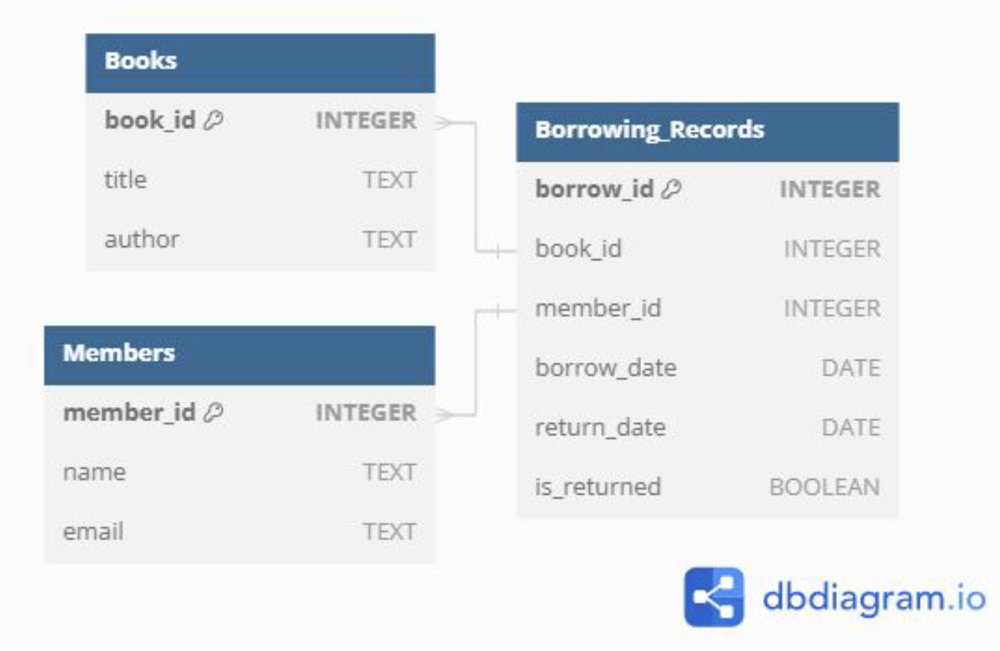

# Library Management System

## Overview
This is a simple Library Management System built using Python, SQLite, and Tkinter. It allows users to manage books, members, and borrowing records in a library.

## Schema



## Features
- **Book Management**: Add, update, and view books.
- **Member Management**: Add, update, and view library members.
- **Borrowing Records**: Track borrowed books, including borrow and return functionalities.
- **Data Export**: Download personal borrowing records, book lists, and member lists as CSV files.

## Requirements
- Python 3.x
- SQLite3
- pandas
- Tkinter (included with standard Python installations)

## Setup
1. Clone the repository:
   ```bash
   git clone https://github.com/DonDonDon02/Library_Management_System.git

   cd <repository-directory> 
   ```

2. Install required packages:

    ```bash
   pip install pandas
   ```


## Overview 


